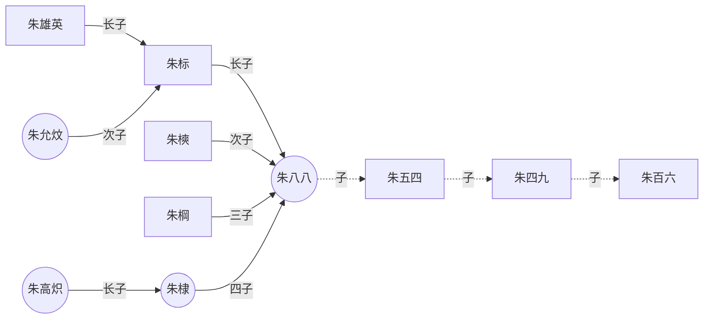
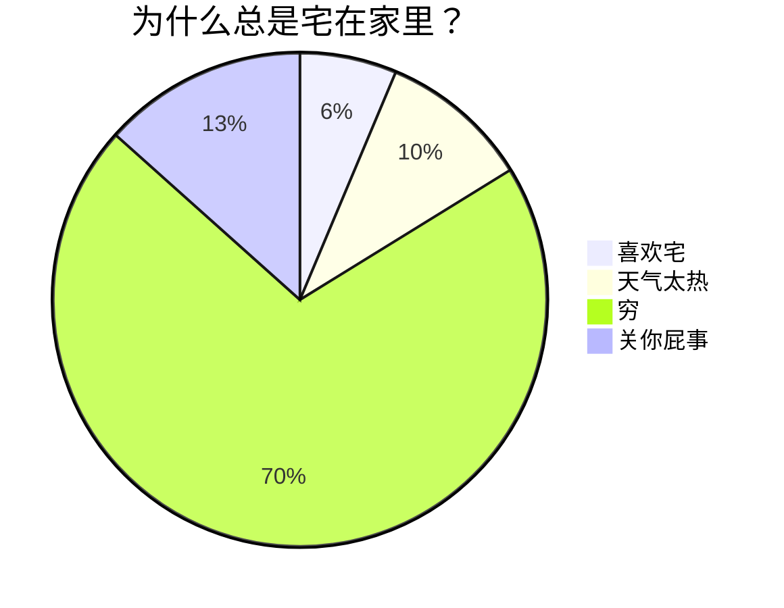
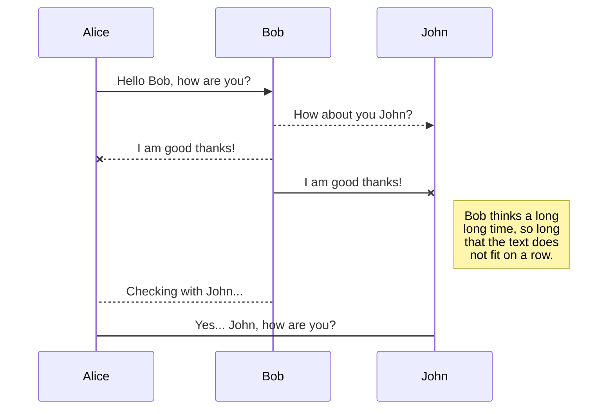
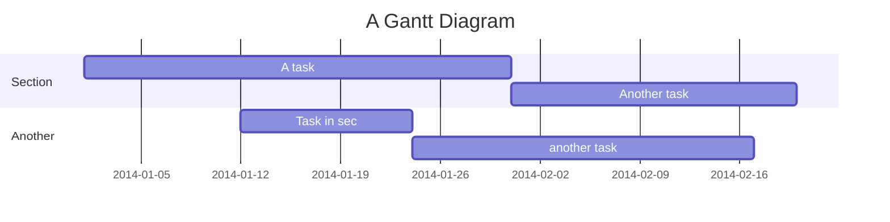

# 工具
## 同步
- [参考链接](https://forum-zh.obsidian.md/t/topic/29995)
- 我这里使用的是 remotely save , nextcloud好像有问题不过 也可以正常配置到 Minio上面
## 图片工具
 - 这里使用的是 image Converter  , 可以直接把图片丢到Assets/文章名/图片 路径内

## 加密
Q：如何加密笔记库或部分笔记？  
ob是编辑器/阅读器，md文件明文存储在硬盘上，因此加密只能加密md文件，否则无意义。ob加密有两种，一种是使用ob插件加密md文件，另一种是使用第三方工具，把ob库文件夹加密。

- ob插件市场有加密插件。
    - Meld Encrypt，加密某个笔记的部分内容，AES256 加密。
    - Cryptsidian，加密全库笔记。（密码错误，可能丢失所有数据，做好备份）
- 第三方加密。
    - veracrypt，开源免费加密工具，安全性高，但同步不很方面。加密后文件为一个单文件，解密为一个虚拟盘符。
    - cryptomator，开源免费加密工具，安全性高，适合网盘同步。加密后文件与解密文件一一对应，但文件名及文件夹结构也是加密的。

本地使用推荐veracrypt、cryptomator，结合网盘使用推荐cryptomator。
## 删除多余图片
Q：如何删除附件文件夹中多余的图片？

- 可以使用插件：find unlinked files或者clear unused imaes，目前推荐后一个。

# 各种图表格
[参考链接](https://mermaid.js.org/syntax/examples.html)
## 流程图

## 饼图

## 时序图

## 甘特图

