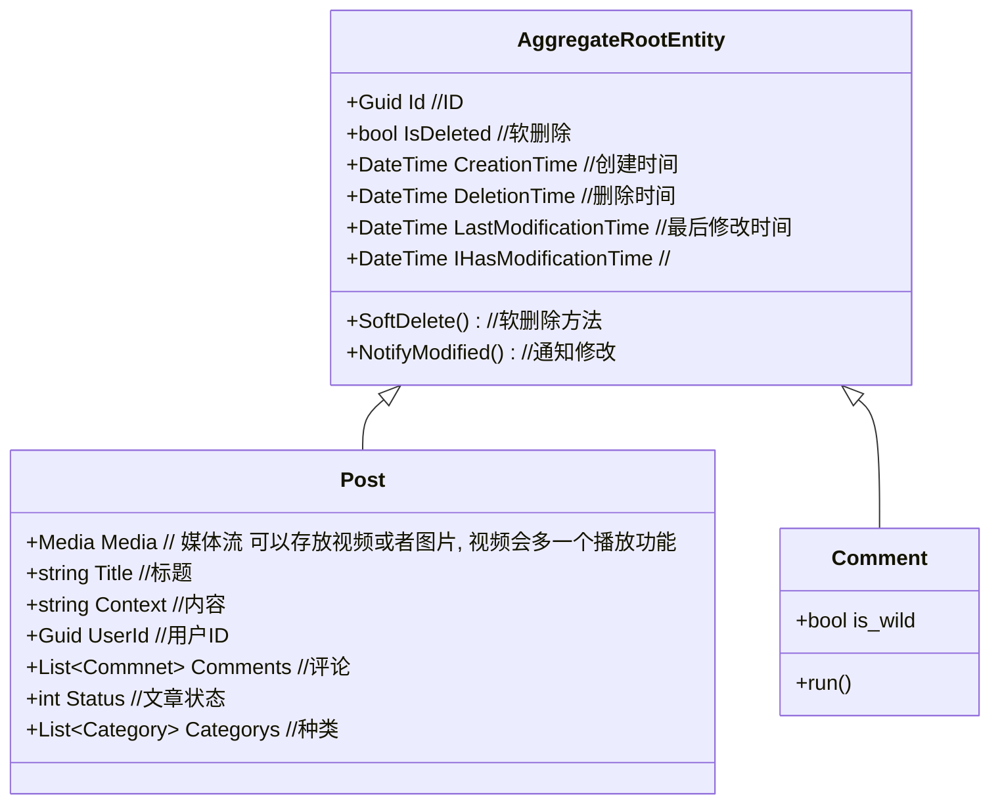
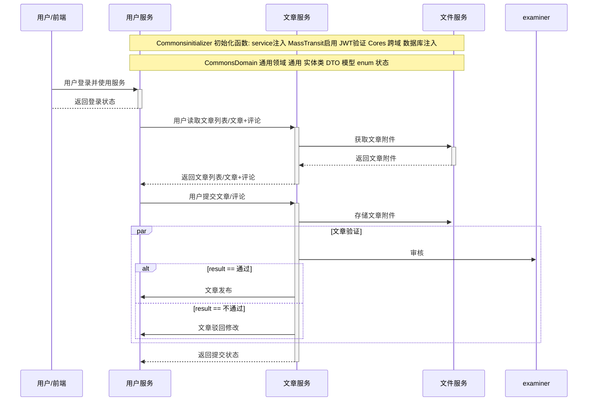
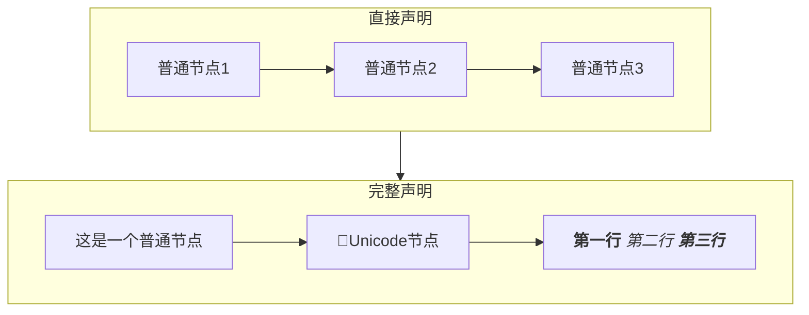
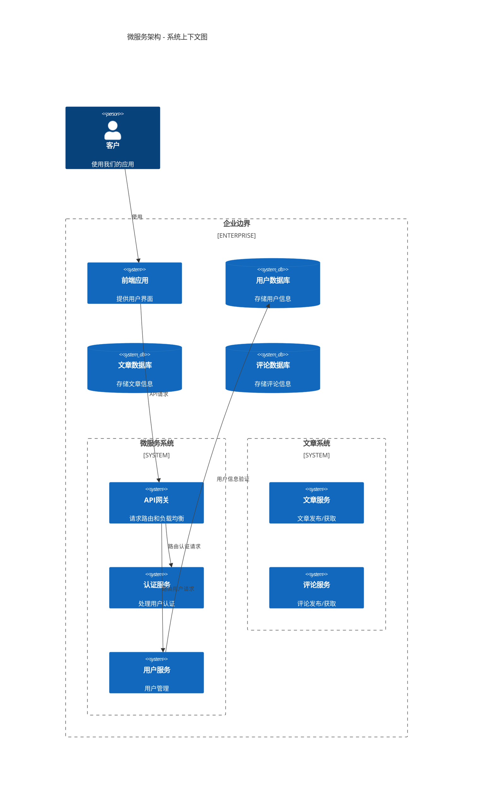

# 类
## 代码
```C#
 public record Post : AggregateRootEntity
 {
     public string Title { get; set; } // 标题
     public string Content { get; set; } // 文本内容
     
     public Guid UserId { get; init; } // 用户ID
     public Guid CommentsId { get; set; } // 评论ID
     public List<Comment> Comments { get; set; } = new List<Comment>();
     public int Status { get; set; } // 状态码
     public List<Category> Categories { get; set; } = new List<Category>();

     public string CoverImageUrl { get; set; } // 封面链接
     public List<string> files { get; set; } // 文件列表
 }
```
## 图 不喜欢

# 流程图



---
# 其他测试图标 暂时弃用



